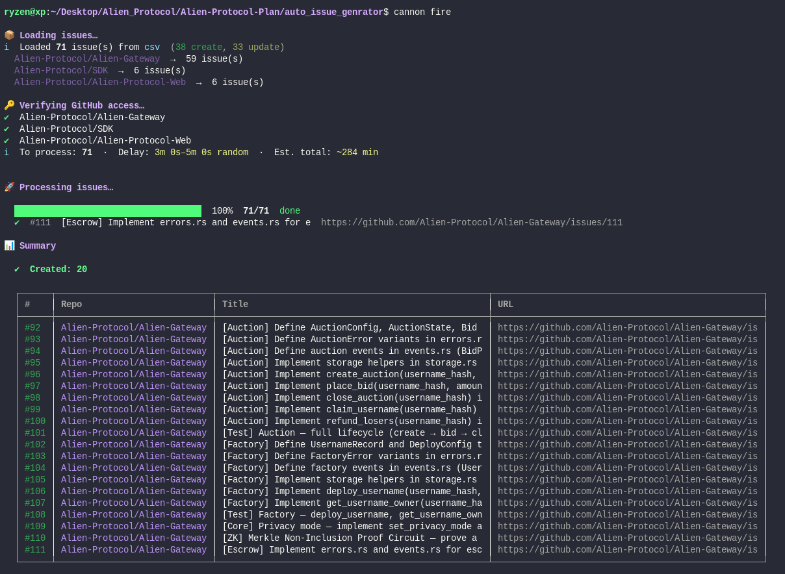
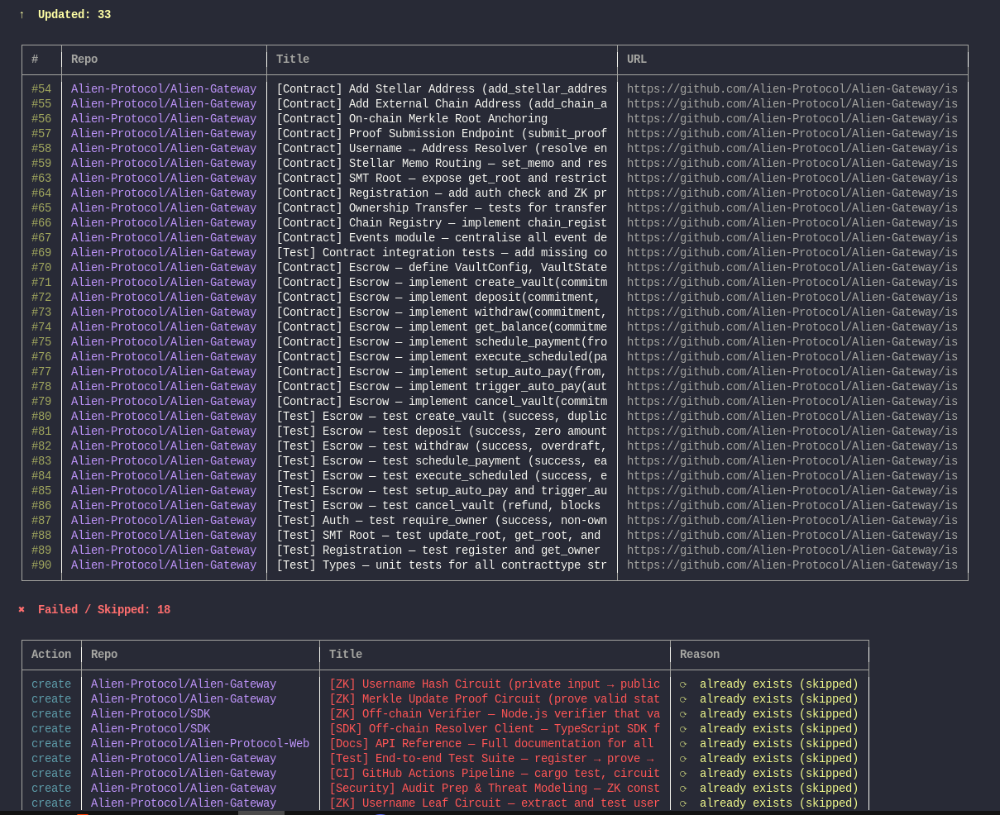

# 🛸 @alien-protocol/cannon

**Stop manually creating GitHub issues.**
Bulk-create, update, and sync issues from CSV, JSON, PDF, DOCX, or any database — in one command.

[](https://www.npmjs.com/package/@alien-protocol/cannon)
[](https://www.npmjs.com/package/@alien-protocol/cannon)
[](LICENSE)
[](package.json)

---

## ⚡ Why Cannon?

| | |
|---|---|
| ⏳ | Save hours of manual issue creation |
| 🔁 | Sync any backlog → GitHub instantly |
| 🛡️ | Built-in duplicate detection & safe delays |
| ⚙️ | Works with CSV, Excel, databases, Word docs |
| ♻️ | Resumable — stop and restart safely |

---

## 🚀 Quick Start

```bash
npm install -g @alien-protocol/cannon
```

```bash
cannon init            # 1. create cannon.config.json
cannon auth login      # 2. OAuth login — no token needed
cannon fire --preview  # 3. dry run — nothing created yet
cannon fire            # 4. go live
```

---

## 👀 See It In Action




---

## 🎯 Use Cases

| Scenario | How |
|----------|-----|
| Import 100+ issues from Excel | Save as CSV → `cannon fire -s csv -f ./issues.csv` |
| Migrate backlog between repos | Export issues, update `repo` column, fire |
| Auto-create from product docs | Convert Word table to DOCX → point cannon at it |
| Sync a database → GitHub | Use `postgres` / `mysql` / `sqlite` source |
| Bulk-update existing issues | Set `action` column to `update` |

---

## 📄 Your Data File

All sources use the same columns:

| Column | Required | Description | Example |
|--------|----------|-------------|---------|
| `repo` | ✅ | Target repository | `owner/repo` |
| `title` | ✅ | Issue title — also the lookup key for `update` | `Fix login bug` |
| `action` | — | `create` (default) or `update` | `create` |
| `body` | — | Description — markdown supported | `Steps to reproduce…` |
| `labels` | — | Comma-separated label names | `bug,auth` |
| `milestone` | — | Auto-created if it doesn't exist | `v1.0` |

### How `action` works

| Value | What cannon does | If title already exists |
|-------|-----------------|------------------------|
| `create` | Opens a new issue | Skipped — duplicate guard |
| `update` | Finds issue by title, patches body / labels / milestone | Title is the stable key |
| *(blank)* | Same as `create` | Same as `create` |

### CSV example

| action | repo | title | body | labels | milestone |
|--------|------|-------|------|--------|-----------|
| `create` | `owner/repo` | Fix login bug | Steps to reproduce… | `bug` | `v1.0` |
| `update` | `owner/repo` | Fix login bug | Updated steps | `bug,high` | `v1.0` |
| `create` | `owner/repo` | Add dark mode | User request | `enhancement` | `v1.1` |

### Supported sources

| Format | Config snippet |
|--------|---------------|
| CSV | `"type": "csv", "file": "./issues.csv"` |
| JSON | `"type": "json", "file": "./issues.json"` |
| PDF | `"type": "pdf", "file": "./issues.pdf"` |
| DOCX / Word | `"type": "docx", "file": "./issues.docx"` |
| SQLite | `"type": "sqlite", "file": "./backlog.db", "query": "SELECT …"` |
| PostgreSQL | `"type": "postgres", "connectionString": "${POSTGRES_URL}", "query": "SELECT …"` |
| MySQL | `"type": "mysql", "connectionString": "${MYSQL_URL}", "query": "SELECT …"` |

---

## ⚙️ Config File

```json
{
  "source": { "type": "csv", "file": "./issues.csv" },
  "mode":   { "safeMode": true, "dryRun": false, "resumable": true },
  "delay":  { "min": 4, "max": 8 }
}
```

| Key | Default | What it does |
|-----|---------|-------------|
| `source.type` | `csv` | One of: `csv` `json` `pdf` `docx` `sqlite` `postgres` `mysql` |
| `mode.safeMode` | `true` | Random 4–8 min delays — prevents GitHub spam flags |
| `mode.dryRun` | `false` | Preview only, nothing is created |
| `mode.resumable` | `true` | Saves progress — safe to stop and restart |
| `delay.min` / `max` | `4` / `8` | Minutes between issues (safeMode only) |

---

## 🖥️ Commands

### Auth
| Command | What it does |
|---------|-------------|
| `cannon auth login` | OAuth login — no token needed |
| `cannon auth status` | Show who is logged in |
| `cannon auth logout` | Remove saved credentials |

### Setup
| Command | What it does |
|---------|-------------|
| `cannon init` | Create `cannon.config.json` |
| `cannon validate` | Check config + source file before firing |

### Fire
| Command | What it does |
|---------|-------------|
| `cannon fire` | Run using `cannon.config.json` |
| `cannon fire --preview` | Dry run — nothing created, no delays |
| `cannon fire --unsafe` | No delays (fast, risky) |
| `cannon fire --delay 2` | Fixed 2-min delay between issues |
| `cannon fire --fresh` | Ignore saved progress, start over |
| `cannon fire -s csv -f ./my.csv` | Override source without editing config |

---

## 🔌 Programmatic Use

```js
import { IssueCannon } from '@alien-protocol/cannon';

const { created, updated, failed } = await new IssueCannon({ safeMode: true })
  .fire({ source: 'csv', file: './issues.csv' });

console.log(`Created: ${created.length}  Updated: ${updated.length}  Failed: ${failed.length}`);
```

---

## 🔐 Token Security

Tokens are **never stored in your project**. `cannon auth login` saves to `~/.cannon/credentials.json` (`chmod 600`).

### Resolution order

| Priority | Source |
|----------|--------|
| 1 | `new IssueCannon({ token: '...' })` — programmatic |
| 2 | `GITHUB_TOKEN` env var or `.env` file |
| 3 | `cannon auth login` → `~/.cannon/credentials.json` |
| 4 | `cannon.config.json` `github.token` — not recommended |

### `.gitignore`

```
.env
.cannon_state.json
cannon-log.json
```

> `cannon.config.json` is safe to commit — just leave `github.token` blank.

---
---
🛸 **Alien Protocol** 
-   Built by [ryzen-xp](https://github.com/ryzen-xp) 
-   [npm](https://www.npmjs.com/package/@alien-protocol/cannon) 
-   [Report a bug](https://github.com/Alien-Protocol/Cannon/issues) 
-   MIT License